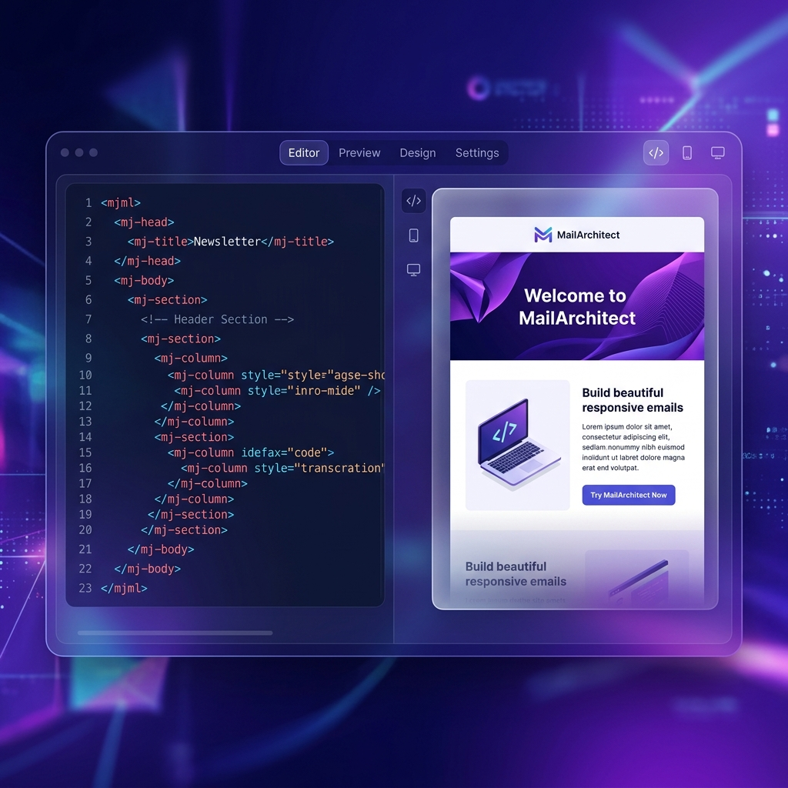

# MailArchitect



**MailArchitect** is a professional, high-performance MJML-based email builder designed for developers and designers who need a fast, reliable, and aesthetically pleasing way to create responsive emails. Built with Vue 3 and MJML-browser, it offers a low-code/no-code interface that bridges the gap between raw MJML and visual editing.

## ✨ Key Features

- **🚀 Drag-and-Drop Editor**: Build complex email structures effortlessly using a specialized structural tree. Sections, columns, and components can be rearranged with full drag-and-drop support.
- **🎨 Class-Based Styling**: Manage styles efficiently using `mj-class` tokens. Define styles once and apply them across multiple components for perfect consistency.
- **🌓 Dual-Theme Support**: Native dark mode support with independent property overrides for every class. Preview and export light and dark versions seamlessly.
- **📱 Live Responsive Preview**: Instant MJML-to-HTML compilation with device presets for Desktop, Tablet, and Mobile.
- **🛠 Rich Text Editing**: Content-editable support for text elements with integrated link management and font-awesome iconography.
- **🔄 State Management**: Industrial-grade Undo/Redo functionality (50 levels) and automatic persistent saving to LocalStorage.
- **📥 Import/Export**: Import existing MJML files or export production-ready, beautified HTML and MJML projects.
- **🎯 Preview Interaction**: Direct interaction with the preview frame. Click any element in the preview to jump to its corresponding node in the editor.

## 🛠 Tech Stack

- **Core**: [Vue 3](https://vuejs.org/) (CDN-based for portability)
- **Engine**: [MJML Browser](https://mjml.io/) (Client-side compilation)
- **Interaction**: [Vuedraggable](https://github.com/SortableJS/Vue.Draggable) for structural management
- **Formatting**: [js-beautify](https://github.com/beautify-web/js-beautify) for clean HTML export
- **Design**: Vanilla CSS with a high-density, glassmorphism-inspired design system
- **Icons**: [Font Awesome 6](https://fontawesome.com/)

## 🚀 Getting Started

MailArchitect is a client-side application that runs entirely in the browser.

1.  **Clone the repository**:
    ```bash
    git clone https://github.com/latvianization/mail-architect.git
    ```
2.  **Open the app**:
    Simply open `index.html` in any modern web browser.
    *For the best experience, serving the directory via a simple local server (like `npx serve .` or Live Server) is recommended.*

## 📂 Project Structure

- `index.html`: Main application entry point and structural layout.
- `css/style.css`: Comprehensive design system and UI styling.
- `js/main.js`: Core Vue application logic and state management.
- `js/components.js`: Reusable Vue components (Tree-Node, etc.).
- `js/constants.js`: MJML component definitions, attribute schemas, and layout scaffolds.
- `js/utils.js`: Helper functions for UID generation, parsing, and rendering.

## ⚖️ License

This project is licensed under the [GPL-3.0 License](LICENSE).

[DEMO] (https://latvianization.github.io/mail-architect/)
---

*Crafted with ❤️ for the email development community.*
